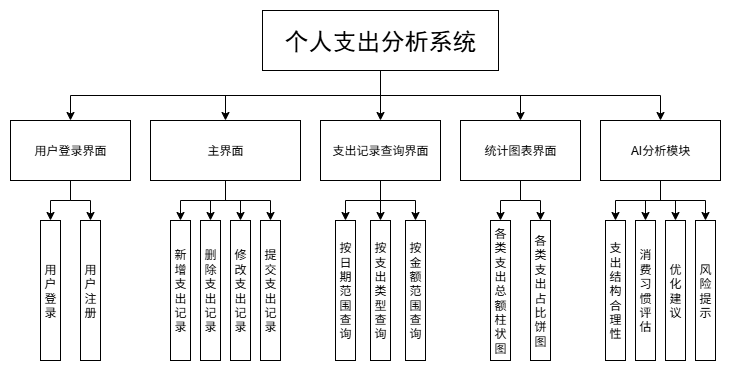
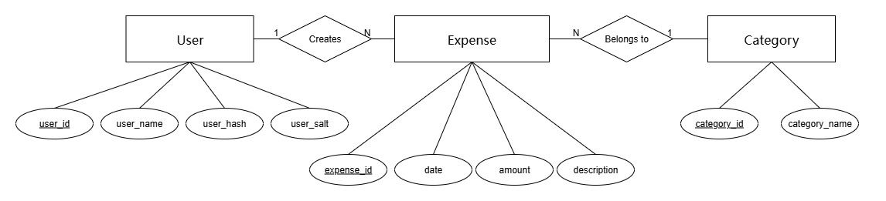
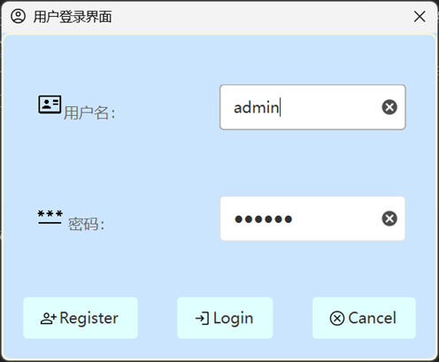
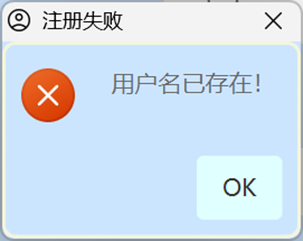
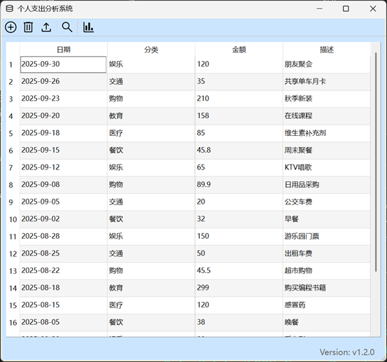
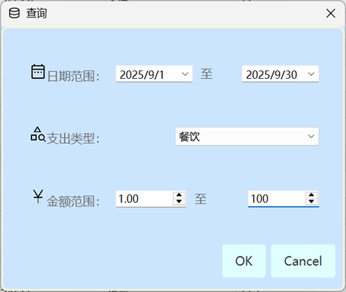
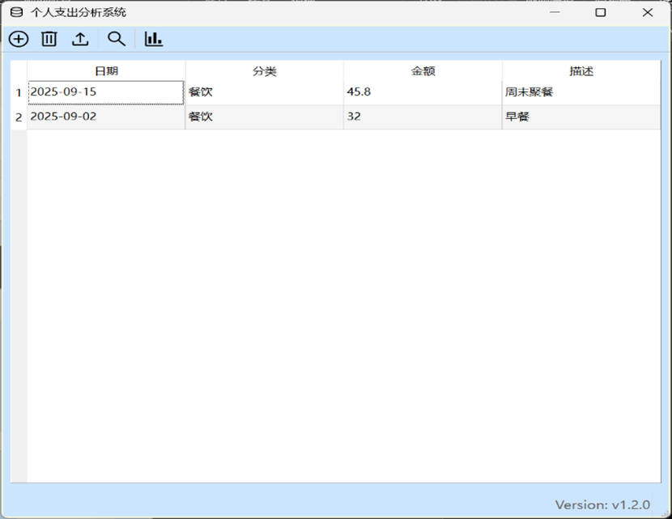
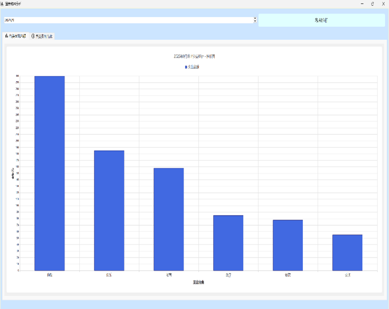
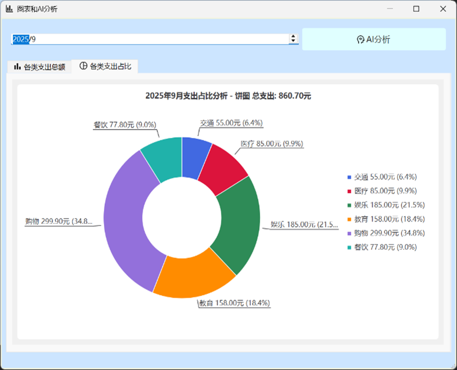
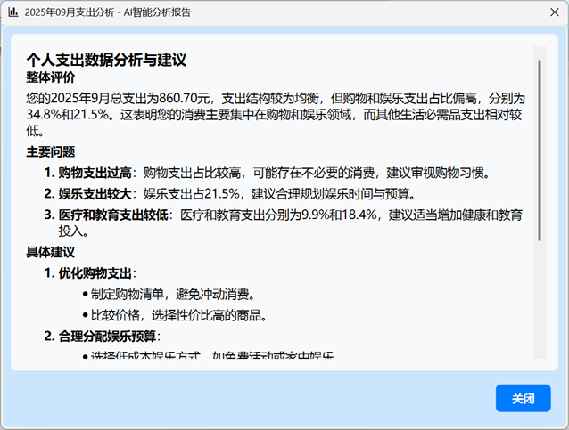

# ExpenseDash - 基于C++/QT的个人支出分析桌面应用

<p align="center">
  <a href="#技术栈"></a>
  <a href="#技术栈"></a>
  <a href="#技术栈"></a>
  <a href="#"></a>
  <a href="#"></a>
</p>

## 📊 项目背景
随着个人财务管理需求的日益增长，个人支出分析系统旨在帮助用户高效、清晰地记录、查询和分析日常支出，从而提升个人财务管理的科学性和便捷性。本系统通过可视化的数据展示和智能分析功能，使用户能够直观了解自身的消费结构、评估消费习惯，并获得合理的优化建议与风险提示，最终实现理性消费和财务健康的目标。

## 🚀 项目简介
**ExpenseDash:** 基于现代C++和Qt框架开发的个人支出管理桌面应用。功能完整、界面友好、操作简便。


> **核心价值**：将复杂的个人财务数据转化为直观的可视化图表与智能分析建议，帮助用户建立健康的消费习惯认知。

## ✨ 核心功能
| **功能模块** | <div style="text-align: center">**功能说明**</div> |
| :---: | :--- |
| **用户管理** | • **用户注册**：用户可通过注册功能创建账户。<br>• **用户登录**：登录后进入系统主界面。 |
| **支出记录管理** | • **新增支出记录**：用户可输入支出金额、类别、日期等信息。<br>• **删除支出记录**：用户可删除被选中的一行记录。<br>• **修改支出记录**：支持对已有记录在表中直接进行编辑。<br>• **提交支出记录**：保存记录至数据库，提交前对修改后的记录进行用户定义完整性检查。 |
| **统计图表展示** | • **各类支出总额柱状图**：直观展示不同类别支出的总金额。<br>• **各类支出占比饼图**：显示各类支出在总支出中的比例。 |
| **智能分析与建议** | • **支出结构合理性评估**：系统自动分析支出是否均衡、是否存在异常消费。<br>• **消费习惯评估**：基于历史数据评估用户的消费行为模式。<br>• **优化建议**：提供节省开支、调整消费结构的个性化建议。<br>• **风险提示**：对可能存在的财务风险进行预警。 |



## 🔧 系统要求与目标

<table>
  <tbody>
    <tr>
      <td><strong>功能性要求</strong></td>
      <td>系统应稳定运行，各项功能响应迅速，数据计算准确</td>
    </tr>
    <tr>
      <td><strong>用户体验要求</strong></td>
      <td>界面简洁直观，操作逻辑合理，操作流程清晰</td>
    </tr>
    <tr>
      <td><strong>可扩展性</strong></td>
      <td>系统应具备良好的模块化结构，便于后续功能扩展</td>
    </tr>
    <tr>
      <td><strong>性能目标</strong></td>
      <td>图表生成与数据分析应在合理时间内完成</td>
    </tr>
  </tbody>
</table>


## 📁 系统架构

数据库设计
系统使用SQLite数据库，包含以下三张表：
|  实体名  |  中文名  |    主码     |         外码         |         其他属性          |        描述        |
| :------: | :------: | :---------: | :------------------: | :-----------------------: | :----------------: |
|   User   |   用户   |   user_id   |          无          |    user_name, user_salt, user_hash    | 用户名称，盐值，密码哈希 |
| Category | 支出分类 | category_id |          无          |       category_name       |      分类名称      |
| Expense  | 支出记录 | expense_id  | user_id, category_id | date, amount, description |  日期、金额、描述  |



#### 表1 User表（用户）

|  属性名   |   含义   |     类型     |    说明    |
| :-------: | :------: | :----------: | :--------: |
|  user_id  |  用户id  |   INTEGER    | 主码，自增 |
| user_name | 用户名称 | VARCHAR(20)  | 非空且唯一 |
| user_salt  | 盐值 | VARCHAR(64) |    非空    |
| user_hash  | 密码哈希 | VARCHAR(256) |    非空    |

#### 表2 Category表（支出类别）

|    属性名     |     含义     |    类型     |    说明    |
| :-----------: | :----------: | :---------: | :--------: |
|  category_id  |  支出分类id  |   INTEGER   | 主码，自增 |
| category_name | 支出分类名称 | VARCHAR(30) |    非空    |

#### 表3 Expense表（支出记录）

|   属性名    |    含义    |      类型      |                 说明                  |
| :---------: | :--------: | :------------: | :-----------------------------------: |
| expense_id  | 支出记录id |    INTEGER     |              主码，自增               |
|   user_id   |   用户id   |    INTEGER     |        外码，引用User(user_id)        |
| category_id | 支出分类id |    INTEGER     |    外码，引用Category(category_id)    |
|    date     |  支出日期  |      DATE      |        格式：YYYY-MM-DD，非空         |
|   amount    |  支出金额  | DECIMAL(10, 2) | 总位数10，小数点后2位，支持负数，非空 |
| description |    描述    |  VARCHAR(50)   |                 可选                  |

## 📂 项目结构

```
ExpenseDash                      # 项目根目录
├─ forms                         # Qt设计师界面文件（.ui）存放目录
│  ├─ chartwindow.ui             # 图表展示窗口界面设计
│  ├─ logindialog.ui             # 用户登录对话框界面设计
│  ├─ mainwindow.ui              # 应用程序主窗口界面设计
│  └─ searchdialog.ui            # 支出记录查询对话框界面设计
│
├─ headers                       # 头文件（.h）存放目录
│  ├─ chartwindow.h              # 图表窗口类定义，负责统计图表的生成与显示
│  ├─ databasemanager.h          # 数据库管理类定义，封装SQLite数据库操作
│  ├─ logindialog.h              # 登录对话框类定义，处理用户认证逻辑
│  ├─ mainwindow.h               # 主窗口类定义，核心业务逻辑与界面交互
│  ├─ searchdialog.h             # 搜索对话框类定义，实现多条件查询功能
│  ├─ user.h                     # 用户实体类定义，对应数据库User表
│  └─ userdao.h                  # 用户数据访问对象类定义，封装用户表操作
│
├─ images                        # 项目文档图片资源
│  ├─ AI分析.png                  # AI分析报告界面截图
│  ├─ E-R图.png                  # 数据库E-R关系图
│  ├─ 主界面.png                  # 应用程序主界面截图
│  ├─ 查询.png                    # 查询对话框界面截图
│  ├─ 查询结果.png                 # 查询结果显示界面截图
│  ├─ 柱状图.png                  # 支出统计柱状图截图
│  ├─ 注册.png                    # 用户注册界面截图
│  ├─ 登录.png                    # 用户登录界面截图
│  ├─ 系统功能模块图.png            # 系统功能模块架构图
│  └─ 饼图.png                    # 支出占比饼图截图
│
├─ resources                     # 应用程序资源文件目录
│  ├─ icons                      # 图标资源子目录
│  │  ├─ account.png             # 账户/用户图标
│  │  ├─ add_circle.png          # 新增记录图标（圆形加号）
│  │  ├─ add_row_below.png       # 在下方插入行图标
│  │  ├─ bar_chart.png           # 柱状图图标
│  │  ├─ cancel.png              # 取消操作图标
│  │  ├─ category_search.png     # 按类别搜索图标
│  │  ├─ check_circle.png        # 确认/完成图标（圆形对号）
│  │  ├─ currency_yuan.png       # 人民币/金额图标
│  │  ├─ database.png            # 数据库图标
│  │  ├─ database_upload.png     # 数据库上传/提交图标
│  │  ├─ data_table.png          # 数据表格图标
│  │  ├─ date_range.png          # 日期范围选择图标
│  │  ├─ delete.png              # 删除操作图标
│  │  ├─ error.png               # 错误提示图标
│  │  ├─ finance.png             # 财务管理图标
│  │  ├─ id_card.png             # 身份证/用户ID图标
│  │  ├─ info.png                # 信息提示图标
│  │  ├─ login.png               # 登录图标
│  │  ├─ mindfulness.png         # 智能分析/思考图标
│  │  ├─ password.png            # 密码图标
│  │  ├─ person_add.png          # 添加用户/注册图标
│  │  ├─ pie_chart.png           # 饼图图标
│  │  ├─ search.png              # 搜索图标
│  │  ├─ synale_expense_sel.ico  # 应用程序图标文件
│  │  ├─ upload.png              # 上传图标
│  │  └─ warning.png             # 警告提示图标
│  ├─ style                      # 样式表文件目录
│  │  └─ style.qss               # Qt样式表，定义应用程序外观
│  └─ res.qrc                    # Qt资源文件，注册所有资源文件
│
├─ sources                       # 源文件（.cpp）存放目录
│  ├─ chartwindow.cpp            # 图表窗口类实现，包含图表生成逻辑
│  ├─ databasemanager.cpp        # 数据库管理类实现，包含SQL语句执行
│  ├─ logindialog.cpp            # 登录对话框类实现，包含用户认证逻辑
│  ├─ main.cpp                   # 程序入口点，初始化应用程序
│  ├─ mainwindow.cpp             # 主窗口类实现，核心功能实现
│  ├─ searchdialog.cpp           # 搜索对话框类实现，查询逻辑处理
│  ├─ user.cpp                   # 用户实体类实现，数据封装方法
│  └─ userdao.cpp                # 用户数据访问类实现，CRUD操作实现
│
├─ ExpenseDash.pro               # Qt项目配置文件，包含源代码和库依赖
├─ LICENSE                       # 开源许可证文件（MIT License）
└─ README.md                     # 项目说明文档，包含功能介绍和使用指南
```

## 📝 使用示例

#### 示例一：用户注册

<table>
  <tr>
    <td align="center">
      
      <br/>
      <em>登录界面</em>
    </td>
    <td align="center">
      
      <br/>
      <em>注册界面</em>
    </td>
  </tr>
</table>

在用户登录界面点击注册后，会检查该用户名称是否已存在。若不存在，则将用户名称和密码插入用户表，user_id每次自增1确保实体完整性；若存在，则弹出窗口显示“用户名已存在”。

#### 示例二：主界面使用

<div align="center">
  
  <br/>
  <em>主界面</em>
</div>

在用户登录界面点击登录后，会显示主界面。包括新增、删除、提交、查询、图标和AI分析功能。

#### 示例三：支出查询

<table>
  <tr>
    <td align="center">
      
      <br/>
      <em>查询条件设置</em>
    </td>
    <td align="center">
      
      <br/>
      <em>查询结果显示</em>
    </td>
  </tr>
</table>

点击查询，弹出查询界面。设定日期范围、支出类型和金额范围后点击OK，将在主界面显示查询结果。

#### 示例四：查看支出图表

<table>
  <tr>
    <td align="center">
      
      <br/>
      <em>柱状图展示</em>
    </td>
    <td align="center">
      
      <br/>
      <em>饼图展示</em>
    </td>
  </tr>
</table>

点击图标和AI分析功能，弹出图表，可选择统计的月份并在柱状图和饼图之间切换。

#### 示例五：查看AI支出分析报告

<div align="center">
  
  <br/>
  <em>AI智能分析报告</em>
</div>

点击AI分析，稍作等待后会显示出AI智能分析报告。

## ✅ 优势

| 方面 | 具体描述 |
|------|----------|
| **功能完备性** | 系统实现了需求分析中提出的所有功能模块，包括用户注册登录、支出记录的增删改查、多条件筛选查询、柱状图与饼图可视化展示以及基于数据分析的智能建议，功能覆盖全面。 |
| **数据完整性保障** | 通过主键自增、外键约束、非空检查等手段，确保了数据的实体完整性和参照完整性。用户定义完整性检查（如金额非负、日期格式等）也在提交时进行了验证，有效防止无效数据入库。 |
| **用户体验良好** | 界面布局清晰，操作流程直观，支持图表交互（如悬停提示）、动态Y轴范围调整等细节设计，提升了用户的使用体验。 |
| **模块化设计** | 系统结构清晰，各功能模块相对独立，便于后续维护与扩展。数据库设计与业务逻辑分离，符合软件工程的高内聚低耦合原则。 |
| **智能分析能力初步实现** | 具备基础的支出结构评估与消费习惯分析功能，能为用户提供初步的财务建议和风险提示，具有一定的实用价值。 |
| **密码安全** | • 加盐哈希：采用SHA256算法+16位随机盐值存储密码哈希<br>• 安全认证：登录验证使用哈希比对，杜绝明文传输风险|

## 📌 已知问题

| 问题类别 | 具体描述 |
|----------|----------|
| **界面美观度一般** | 虽然功能完整，但界面设计较为朴素，未充分运用Qt的样式表（QSS）进行美化，视觉吸引力不足。 |
| **缺乏数据导入导出功能** | 用户无法导出支出记录或图表为常见格式（如Excel、PDF），也不支持从外部文件导入数据，限制了数据的便携性与共享性。 |
| **多用户并发处理能力未测试** | 系统在设计时未充分考虑多用户同时操作数据库的情况，可能存在并发访问时的数据一致性问题。 |
| **移动端适配缺失** | 系统仅支持桌面端使用，未提供移动端界面或响应式布局，无法满足用户随时随地记账的需求。 |

## 🚧 待完善

| 完善方向 | 具体内容 |
|----------|----------|
| **优化界面与交互设计** | 使用QSS对界面进行美化，增加动画效果和更丰富的交互反馈，提升用户体验。 |
| **增加数据导入导出功能** | 支持导出报表为Excel、PDF等格式，并允许用户通过CSV等格式导入历史数据。 |
| **扩展多平台支持** | 考虑开发Android/iOS版本或使用Qt for WebAssembly提供网页版服务，增强系统的可访问性。 |
| **加强系统安全性与稳定性** | 对用户密码进行加密存储，增加操作日志记录，优化数据库并发控制机制，提升系统整体安全性与鲁棒性。 |
